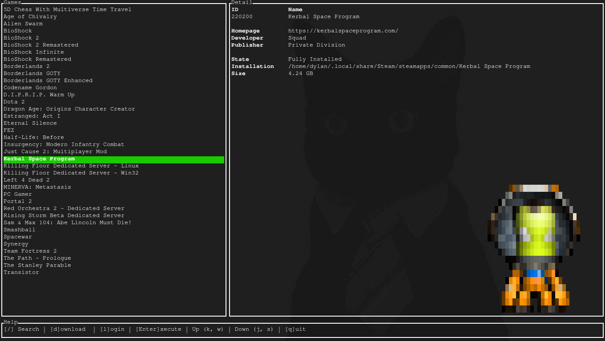

# Steam TUI

  

## About
Just a simple TUI client for `steamcmd`. Allows for the graphical launching,
updating, and downloading of steam games through a simple terminal client.

## Requirements

[`steamcmd`](https://wiki.archlinux.org/title/steam#SteamCMD) is required to
launch steam-tui, as `steam-tui` is essentially just a graphical wrapper for
this program.

## Why ?
Because why not? Also, the Steam client seems to break on my Arch build. I have
a GT 610, and barely anything graphical works- this is a nice work around.

## Contributing

At this point, I am very much done with the project. I only really play
[Kerbal](https://www.kerbalspaceprogram.com/) and [5 Dimensional Chess with
Multiverse Time Travel](https://www.5dchesswithmultiversetimetravel.com/), so
additional work on this project is moot. If you [buy me a
coffee](https://github.com/sponsors/dmadisetti), I'd be happy to sink some more
time into this.

## Missing Features

- Real time download updates
- Real time running game updates
- Filtering for DLCs etc..
- Automatic icon downloads
